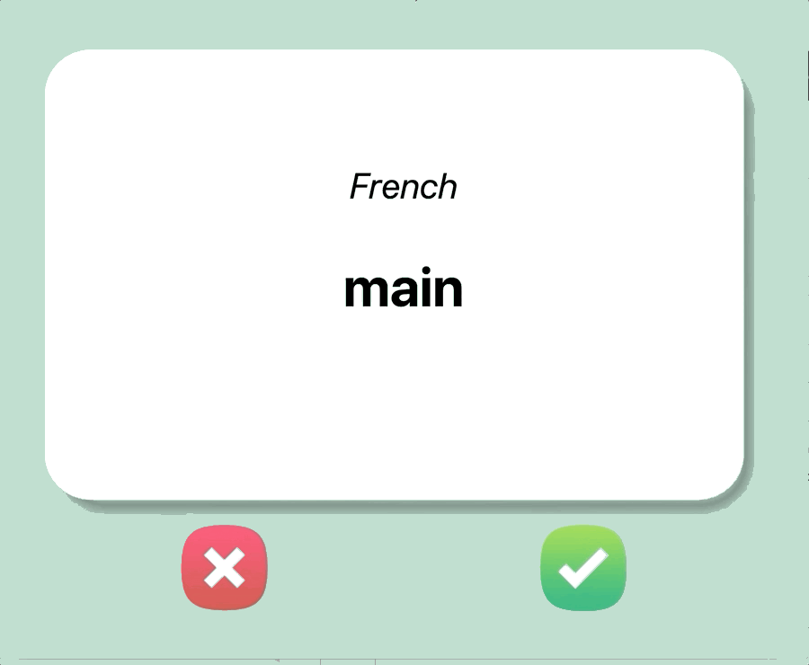

# langSmart
langSmart is an intermediate program written in Python that let's you learn any language via flash cards.
=======
# Day 31 - Flash card | 100DaysOfCode - Complete python bootcamp

This program was developed per the complete Python bootcamp by Angela Yu | AppBrewery 

## Concepts Practised

- Reading and writing JSON data
- Building beautiful UI with Tkinter library in Pythons
- Data collection and manipulation using the Pandas Library

## LangSmart [Language Smart]
